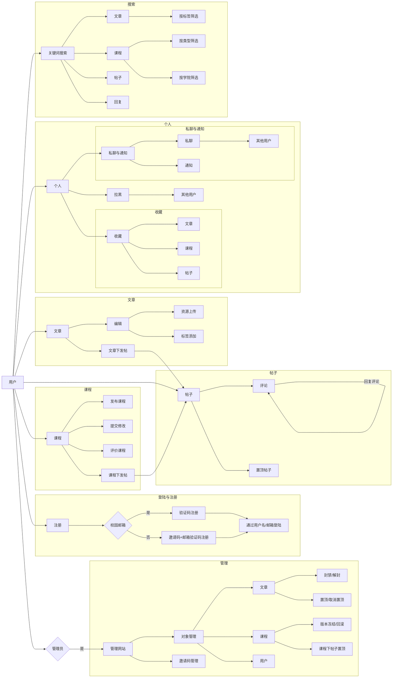

# ShareSDU - 山东大学校园资源分享平台

[](https://github.com/W1412X/sharesdu/actions/workflows/web-ci.yml)
[](https://github.com/W1412X/sharesdu/actions/workflows/android-ci.yml)
[](https://github.com/W1412X/sharesdu/actions/workflows/docs-check.yml)
[](https://github.com/W1412X/sharesdu/actions/workflows/pr-check.yml)

一个面向山东大学师生的资源分享与交流平台，支持文章发布、课程评价、帖子讨论等功能。

## 📱 多端支持

- **Web 端**：基于 Vue 3 + Vuetify 的响应式 Web 应用
- **Android 端**：原生 Android 应用
- **HarmonyOS 端**：鸿蒙原生应用

## 📖 文档

- **[Web 前端文档](./web/docs/README.md)** - 前端架构、优化和重构文档
- **[API 文档](./api.md)** - 后端 API 接口文档

## 🚀 快速开始

### Web 端开发

```bash
cd web
npm install
npm run serve
```

### 构建生产版本

```bash
npm run build
```

## 🎯 功能示意  

